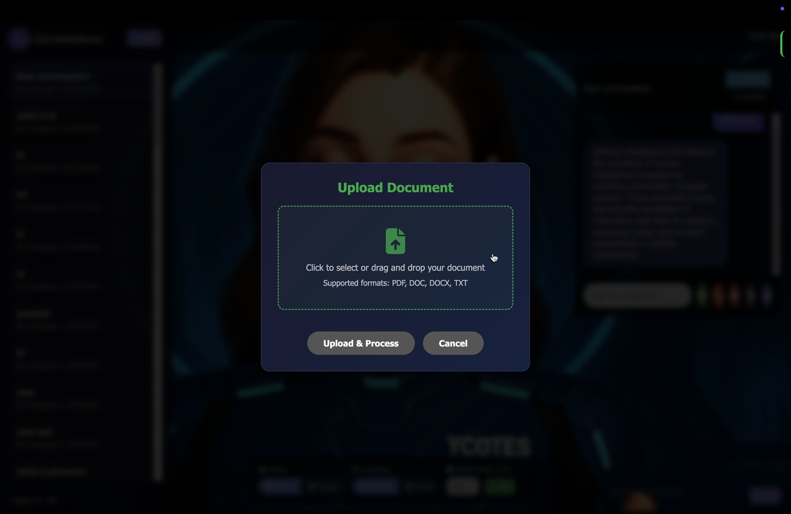

# 🧠 AI Professor - The Next Generation of Intelligent Teaching
> *"The best ever AI model till date, redefining how we learn, teach, and interact with knowledge."*

---

## 📘 Overview

**AI Professor** is a revolutionary AI-driven learning assistant designed to function like a real human professor — capable of **teaching, answering questions, generating notes, and guiding students** through complex subjects using advanced **Retrieval-Augmented Generation (RAG)** and **multimodal AI** capabilities.

This repository, **`ai-prof-mujhacx`**, contains **all code modules, backend logic, frontend interfaces, and AI pipelines** that power the AI Professor project — a model built to **reimagine digital education** with intelligence, adaptability, and personalization.

---

## 🚀 Key Features

### 🧩 1. Intelligent RAG Architecture  
- Combines **GPT-5** with **Pinecone Vector Database** for **context-aware retrieval**.  
- Delivers highly accurate, real-time answers using stored academic data.  
- Automatically fetches and prioritizes the most relevant knowledge.

### 🗂️ 2. Multi-Modal Input Support  
- Accepts **text, PDFs, URLs, and documents** for knowledge ingestion.  
- Handles **video and audio-based content** (under processing pipeline).  
- Enables deep learning on custom content and datasets.

### 🧑‍🏫 3. Personalized Teaching  
- Adapts explanations based on **user understanding and tone** (friend/study mode).  
- Supports multilingual output (English + Hindi/Devanagari fallback).  
- Integrates **text-to-speech and speech recognition** for hands-free learning.

### 🧠 4. Advanced Knowledge Generation  
- Generates **summaries, quizzes, sub-questions, and lecture notes** automatically.  
- Contextually references past chats for a continuous learning experience.  
- Stores data in **Pinecone namespaces** for semantic retrieval and versioning.

---

## 🏗️ System Architecture

- **Frontend:** Streamlit / Web UI with real-time chat interface.  
- **Backend:** Python + FastAPI / Flask for processing requests.  
- **AI Core:** GPT-5 model with RAG enhancement.  
- **Vector Store:** Pinecone (Cosine Similarity Index).  
- **Storage:** Local + Cloud (for user documents, embeddings, and metadata).  

A simplified diagram of the flow:
